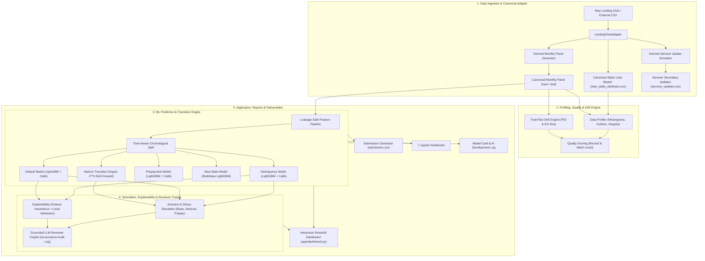

# Loan Performance Intelligence Engine

[](https://www.python.org/downloads/release/python-3120/)
[]()
[]()
[]()

> **Prototype Implementation for the Intain Campus FinTech Challenge 2026 (AI Track)**  
> An enterprise-grade, non-LLM machine learning and data intelligence system for loan data profiling, quality scoring, drift monitoring, delinquency/default/prepayment/next-state modeling, multi-period Markov transition forecasting, hybrid anomaly triage, macroeconomic stress simulation, and grounded LLM reviewer copilot assistance.

---

## Dataset Provenance Notice

> **"Prototype implementation uses publicly available Lending Club historical loan data because the organizer-provided competition dataset was unavailable at implementation time."**

The architecture implements a strict **Adapter Pattern** (`LendingClubAdapter`), isolating all raw dataset specifics from canonical internal schemas (`CanonicalStaticLoan`, `CanonicalMonthlyPerformance`). When the official competition dataset is released, replacing the data source requires updating only the adapter layer without modifying any downstream ML models, profiling pipelines, anomaly engines, or dashboard interfaces.

---

## Architecture Overview



---

## Project Directory Structure

```text
loan-performance-intelligence-engine/
│
├── .venv/                              # Python 3.12 project virtual environment
│
├── data/
│   ├── external/                       # Raw downloaded datasets (Lending Club)
│   ├── raw/
│   ├── canonical/                      # Clean canonical schema files
│   │   ├── loan_static_attributes.csv
│   │   ├── loan_monthly_performance_train.csv
│   │   ├── loan_monthly_performance_test.csv
│   │   ├── servicer_updates.csv
│   │   ├── macro_scenarios.csv
│   │   ├── validation_rules.json
│   │   ├── data_dictionary.md
│   │   └── submission_template.csv
│   └── processed/
│
├── src/
│   ├── config/                         # Settings and Pydantic schemas
│   ├── ingestion/                      # Data acquisition and monthly panel generator
│   ├── adapters/                       # Lending Club to Canonical schema adapter
│   ├── profiling/                      # Missingness, outliers, integrity, PSI drift
│   ├── quality/                        # Record-level and batch-level quality scoring
│   ├── features/                       # Leakage-safe feature engineering & time splitter
│   ├── models/                         # Delinquency, Default, Prepayment, Next-State models
│   ├── evaluation/                     # Metric evaluation suite (ROC, PR, Brier, Calibration)
│   ├── transitions/                    # Markov state transition matrix & multi-period projection
│   ├── anomaly/                        # Rules engine, Isolation Forest, reconciliation triage
│   ├── scenarios/                      # Macroeconomic stress testing engine
│   ├── explainability/                 # Global importance, local attribution, uncertainty
│   ├── copilot/                        # Grounded LLM reviewer copilot & audit logging
│   ├── reporting/                      # Executive intelligence report generator
│   └── utils/                          # Structured logging & serialization
│
├── scripts/
│   ├── download_data.py                # Dataset acquisition script
│   ├── prepare_data.py                 # Ingestion and canonical dataset builder
│   ├── train_models.py                 # Model training and calibration script
│   ├── run_scenarios.py                # Scenario stress testing script
│   ├── generate_submission.py          # Submission generator & validator
│   ├── generate_notebooks.py           # Notebook builder
│   └── run_pipeline.py                 # Unified end-to-end orchestrator
│
├── app/
│   └── dashboard.py                    # 10-module interactive Streamlit dashboard
│
├── notebooks/                          # 7 Production Jupyter Notebooks
│   ├── 01_data_profiling.ipynb
│   ├── 02_feature_engineering.ipynb
│   ├── 03_predictive_models.ipynb
│   ├── 04_transition_model.ipynb
│   ├── 05_anomaly_detection.ipynb
│   ├── 06_scenarios.ipynb
│   └── 07_llm_copilot.ipynb
│
├── artifacts/
│   ├── models/                         # Serialized trained models (*.joblib)
│   ├── metrics/                        # JSON performance metrics & drift reports
│   ├── predictions/                    # submission.csv & exception dossiers
│   ├── plots/
│   ├── reports/                        # Executive Intelligence Report (Markdown)
│   └── logs/                           # Pipeline & Copilot audit JSONL logs
│
├── docs/
│   ├── MODEL_CARD.md                   # Comprehensive Model Card
│   ├── AI_DEVELOPMENT_LOG.md           # Transparent AI development log
│   └── ARCHITECTURE.md                 # System architecture documentation
│
├── tests/                              # Pytest test suite (10 test modules)
├── requirements.txt                    # Pinned Python 3.12 dependencies
├── pyproject.toml
└── README.md
```

---

## Environment Setup (Mandatory Python 3.12)

```bash
# 1. Verify Python 3.12 is installed
python3.12 --version

# 2. Create and activate local virtual environment
python3.12 -m venv .venv
source .venv/bin/activate

# 3. Upgrade pip and install dependencies
pip install --upgrade pip
pip install -r requirements.txt

# 4. Verify environment
which python
# Must output: .../loan-performance-intelligence-engine/.venv/bin/python
```

---

## Jupyter Environment Configuration

The repository registers a dedicated project kernel mapped directly to `.venv`:

```bash
source .venv/bin/activate
python -m ipykernel install --user --name loan-performance-engine --display-name "Loan Performance Intelligence Engine"
```

To launch Jupyter Lab / Notebooks:
```bash
jupyter lab notebooks/
```

---

## Quickstart: Running the End-to-End Pipeline

Execute the unified pipeline orchestrator:

```bash
source .venv/bin/activate

# Run the complete end-to-end pipeline
python scripts/run_pipeline.py
```

Or execute modular pipeline stages sequentially:

```bash
# Stage 1: Acquire Lending Club data (or synthetic prototype fallback)
python scripts/download_data.py

# Stage 2: Transform raw records, generate monthly panels & servicer updates
python scripts/prepare_data.py

# Stage 3: Train and calibrate all ML predictive and transition models
python scripts/train_models.py

# Stage 4: Run macroeconomic stress testing scenarios
python scripts/run_scenarios.py

# Stage 5: Validate and generate submission.csv
python scripts/generate_submission.py
```

---

## Launching the Interactive Streamlit Dashboard

Launch the 10-module rich interactive dashboard:

```bash
source .venv/bin/activate
streamlit run app/dashboard.py
```

### Dashboard Sections:
1. **Portfolio Overview**: Executive KPIs, balance totals, FICO distributions, purpose breakdowns.
2. **Data Profiling**: Column profiles, missingness analysis, Pearson feature correlation matrix.
3. **Data Quality & Drift Monitor**: Dataset quality scores, PSI, and Kolmogorov-Smirnov drift tables.
4. **Predictive Models & Calibration**: ROC-AUC, PR-AUC, F1, Brier score, and Confusion Matrices.
5. **Transition & Survival Modeling**: 1-month transition matrices and 36-month absorption curves.
6. **Anomalies & Exception Dossiers**: Reviewer triage queue with severity ratings and recommendations.
7. **Scenario Simulation**: Stress testing across `BASE`, `ADVERSE_CREDIT`, and `HIGH_PREPAYMENT`.
8. **Explainability**: Global feature importance and interactive loan risk attribution inspector.
9. **Grounded LLM Copilot**: Grounded loan review note generator, failure-mode benchmarks, and audit log viewer.
10. **Model Card & Metadata**: System lineage, assumptions, and governance documentation.

---

## Running Automated Tests

Execute the comprehensive test suite with coverage:

```bash
source .venv/bin/activate
python -m pytest tests/ -v --cov=src --cov-report=term-missing
```

---

## Limitations & Honest Provenance Disclaimers

1. **Lending Club Provenance**: Lending Club data reflects US unsecured retail installment loans and differs in structure from specific mortgage or auto loan data packs that the competition organizer may provide.
2. **Derived Temporal Panel**: The monthly performance panel is derived from static characteristics and empirical transition hazards to enable temporal modeling. It is explicitly labeled as prototype data.
3. **Derived Secondary Updates**: Servicer updates and conflict tapes are derived to demonstrate multi-source reconciliation.
4. **Scenario Projections**: Scenario simulation outputs represent model-based sensitivity stress projections, not guaranteed causal macroeconomic forecasts.
5. **Human Review Requirement**: All AI Copilot recommendations carry the mandatory label: **"Recommendation — requires human review"**.
