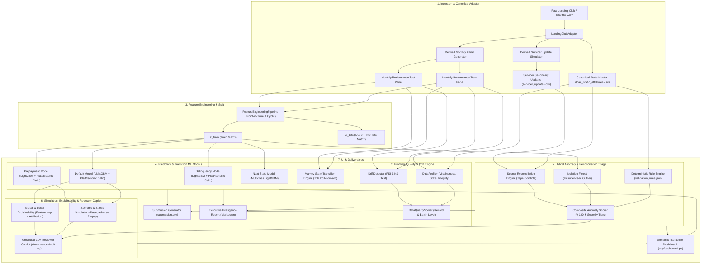

# System Architecture — Loan Performance Intelligence Engine

## 1. High-Level Architectural Topology

---

## 2. Core Architectural Principles
1. **Strict Canonical Schema Decoupling**: Upstream datasets (Lending Club prototype, synthetic data, or future official organizer datasets) are decoupled via `LendingClubAdapter`. Core ML and downstream engines only interact with canonical schemas.
2. **Zero-Leakage Temporal Modeling**: Feature engineering enforces strict point-in-time calculation. Future targets are derived purely from $t+1 \dots t+h$ future panels and never leak into feature vectors.
3. **Calibrated Tabular ML**: Tree-based gradient boosters are combined with Isotonic regression and Platt scaling to ensure well-calibrated loss estimates.
4. **Hybrid Anomaly Triangulation**: Merges deterministic business logic, unsupervised ML (Isolation Forest), and subservicer tape reconciliation.
5. **Grounded AI Governance**: LLM copilot is grounded in codified data dictionaries and validation rules, logs all interactions to JSONL audit ledgers, and operates 100% offline without external API dependencies.
